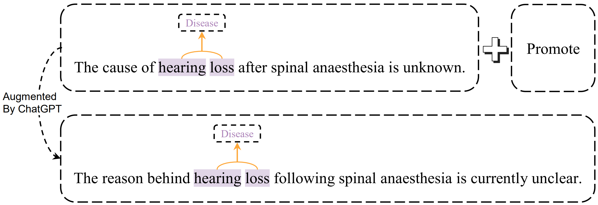
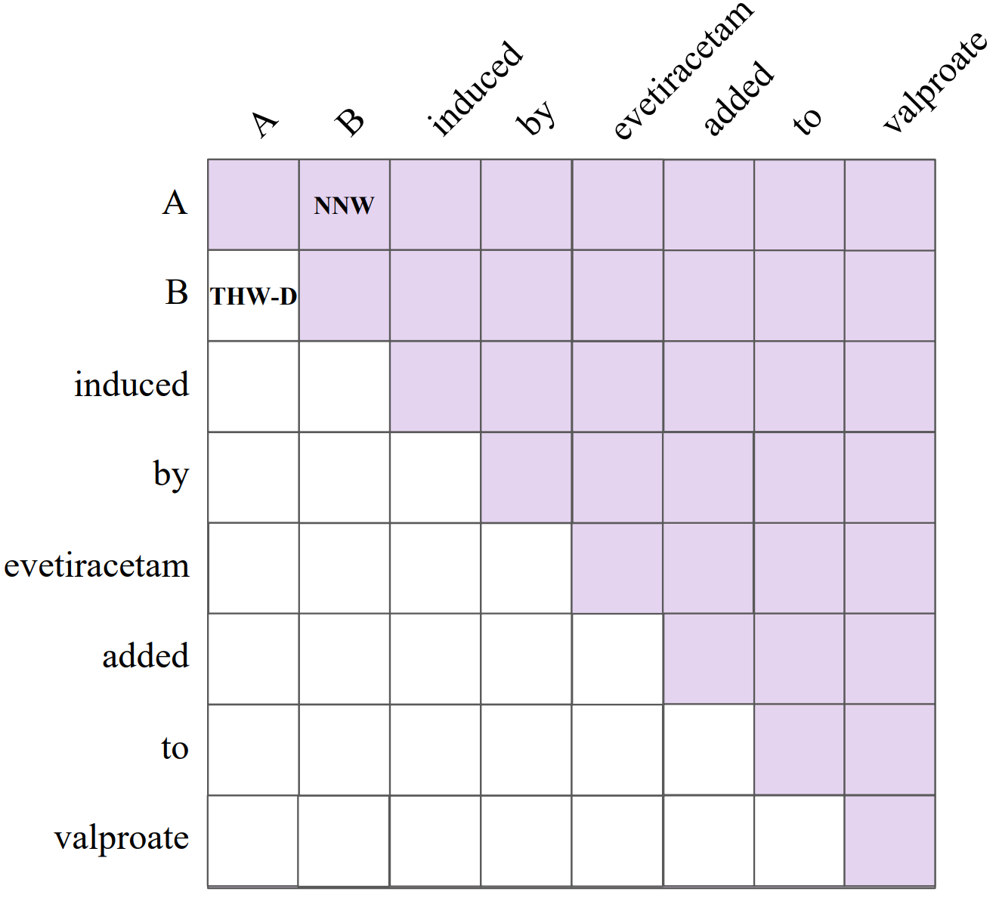
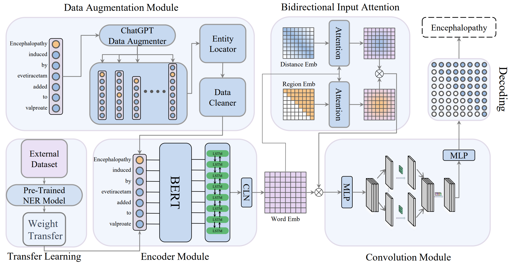

 # Data Augmentation for Few-Shot Named Entity Recognition Using ChatGPT with Transfer Learning(DACT)
 

### 1_aug_exam
<p align="center">
  
</p>
 

### 2_decode
<p align="center">
  
</p>


### 2_model
<p align="center">
  
</p>

## 1. Environments

```
- python (3.8.12)
- cuda (11.4)
```

## 2. Dependencies

```
- numpy (1.21.4)
- torch (1.10.0)
- gensim (4.1.2)
- transformers (4.13.0)
- pandas (1.3.4)
- scikit-learn (1.0.1)
- prettytable (2.4.0)
```

## 3. Dataset

We provide some datasets processed in our code.

## 4. Preparation

- 根据小样本原始数据，使用ChatGPT进行增强（code中已经给出）
- 预训练相关数据集的迁移权重
- 在训练增强后的小样本数据时，迁移已经训练好的相关数据权重

## 5. Training

```bash
- 训练迁移权重
>> python main-All_BC5CDR-disease.py
>> python main-All_NCBI.py
>> python main-All_BioNLP11EPI-IOBES.py
>> python main-All_BioNLP13GE-IOBES.py

- 复制迁移权重，四个数据集均以20-1为例，5-1，5-2，5-3，5-4，5-5，20-1，20-2，20-3，20-4，20-5，50-1，50-2，50-3，50-4，50-5的训练方法均和20-1相同。
- 其中train_name和dev_name代表的是train和dev使用的数据集名字。
- 以训练BC5CDR-disease数据集为例，其中All_NCBI.pt为训练迁移权重时，‘python main-All_NCBI.py’保存的权重

-训练BC5CDR-disease数据集
>> cp All_NCBI.pt NCBI-20-1.pt
>> python main.py --config ./config/All_BC5CDR-disease-20-1.json --train_name train_best_clear --dev_name dev_best_clear

-训练NCBI数据集
>> cp All_BC5CDR-disease.pt BC5-20-1.pt
>> python main.py --config ./config/All_BC5CDR-disease-20-1.json --train_name train_best_clear --dev_name dev_best_clear

-训练BioNLP11EPI数据集
>> cp All_BioNLP13GE-IOBES.pt Bio13-20-1.pt
>> python main.py --config ./config/All_BC5CDR-disease-20-1.json --train_name train_best_clear --dev_name dev_best_clear

-训练BioNLP13GE数据集
>> cp All_BioNLP11EPI-IOBES.pt Bio11-20-1.pt
>> python main.py --config ./config/All_BC5CDR-disease-20-1.json --train_name train_best_clear --dev_name dev_best_clear
```


